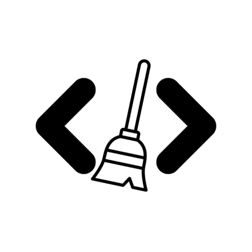
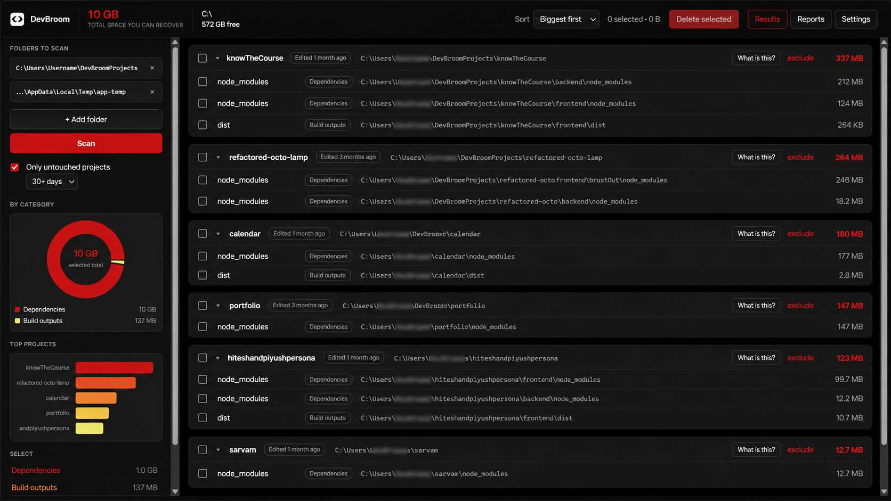
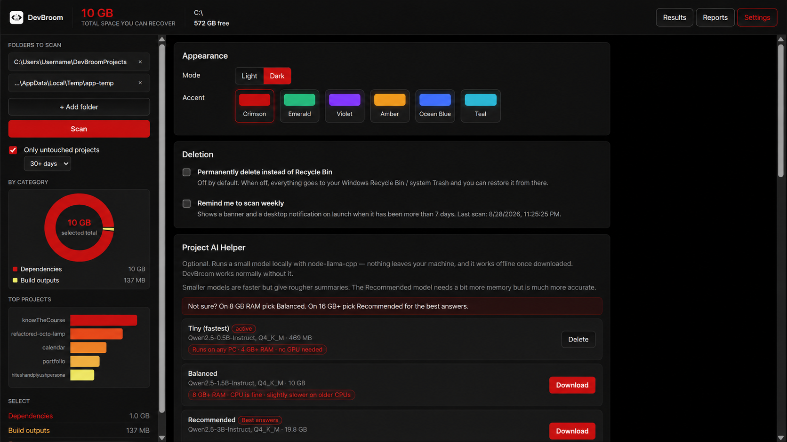
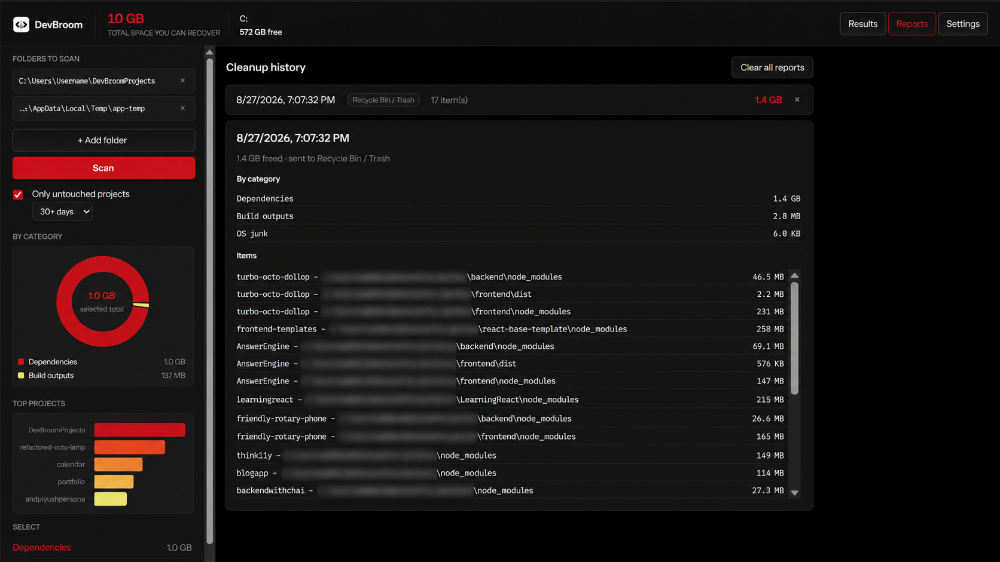
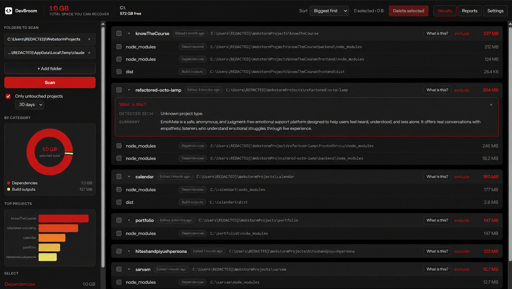

<div align="center">



# DevBroom

**Sweep the dead weight out of your dev machine — safely.**

[](https://github.com/bhrdwjuddhv/DevBroom/actions/workflows/build.yml)
[](LICENSE)
[](https://github.com/bhrdwjuddhv/DevBroom/releases/latest)

</div>

---

## What it does

Every project folder you own is quietly hoarding gigabytes you will never read again: `node_modules`
from a repo you last touched in 2023, `dist` folders, Vite and Turbo caches, `__pycache__`, stray
`*.log` files. Deleting them by hand means remembering which folders are safe.

DevBroom scans the folders where your projects live, groups what it finds **by project**, shows you
exactly how much space each item is using, and moves the ones you tick to the **Recycle Bin** — not
into the void. Nothing is deleted without a confirmation, and nothing outside the folders you chose can
be touched.

It is fully offline, has zero telemetry, and the whole thing is about 1,500 lines you can read yourself.

<!-- ## Screenshots

| Scan results | Settings & themes |
| --- | --- |
|  |  |

| Cleanup reports | Local AI helper |
| --- | --- |
|  |  |

> Screenshots live in [`./assets`](./assets). Replace the placeholders above with your own captures. -->

## Features

- **Scans by project.** Every folder with a `package.json` or `.git` is a project; results are grouped
  under it with per-project and per-category subtotals.
- **Accurate sizes.** Each match is measured once and never descended into, so `node_modules/.cache`
  is never double-counted. `.git` is skipped entirely.
- **Live progress.** Item count, running total and the current path stream in while the scan runs, and
  a determinate progress bar with "7 of 23" and the exact path while items are removed.
- **Recycle Bin by default.** Permanent deletion exists, is off by default, and needs its own
  acknowledgement every time.
- **Charts.** A donut of recoverable space by category and a bar chart of your five biggest projects,
  both following your current selection.
- **Disk meter.** Free space on the drive in the top bar, switching to `before → after` after a cleanup.
- **Smarter cleaning.** Filter to projects untouched for 30/60/90 days — measured from real source
  files, not from the folders being cleaned — and get a warning badge plus an extra confirmation on
  anything edited in the last week.
- **Configurable rules.** Toggle any built-in rule, or add your own folder name or file pattern
  (`*.tsbuildinfo`, `.venv`, …). Categories that need judgement ship disabled.
- **Exclusions.** Skip specific projects or paths in every future scan.
- **Cleanup reports.** Every cleanup is logged locally with its items, category breakdown, space freed
  and where it went.
- **Themes.** Light and dark, six accent colours, Instrument Sans bundled locally.
- **Optional offline AI helper.** Download a small model and get a plain-English explanation of what a
  project is before you clean it — see below.

## Download

Grab the latest installer from the **[Releases page](https://github.com/bhrdwjuddhv/DevBroom/releases/latest)**:

| Platform | File |
| --- | --- |
| Windows 10/11 | `DevBroom-Setup-1.0.0.exe` |
| macOS | `DevBroom-1.0.0.dmg` |
| Linux | `DevBroom-1.0.0.AppImage` or `devbroom_1.0.0_amd64.deb` |

The Windows installer lets you choose the install location and creates **Desktop and Start Menu
shortcuts**. It installs per-user, so it does not require an administrator password.

### Windows SmartScreen warning

DevBroom's installer is **not code-signed**, because a Windows code-signing certificate costs a few
hundred dollars a year and this is a free open-source project. Windows will therefore show:

> **Windows protected your PC** — Microsoft Defender SmartScreen prevented an unrecognised app from
> starting. Publisher: Unknown publisher.

This is expected. To install anyway:

1. Click **More info**.
2. Click **Run anyway**.

This warning appears for essentially every unsigned free app and says nothing about whether the app is
safe — it only means nobody paid to register a certificate. If you would rather not take anyone's word
for it, [build it from source](#build-from-source): it takes two commands and you get the identical app.

*(If you do buy a certificate later, the commented **CODE SIGNING** block in
[`electron-builder.yml`](electron-builder.yml) shows exactly which keys to add.)*

## Build from source

Requires **Node.js 20+** (22 recommended) and npm.

```bash
git clone https://github.com/bhrdwjuddhv/DevBroom
cd DevBroom
npm install

npm run dev     # dev server + Electron window, with hot reload
npm run build   # build the renderer into dist/
npm test        # scanner + AI-helper self-checks
npm run dist    # package an installer for your current OS into release/
```

`npm run dist` builds for whatever OS you run it on. To produce Windows, macOS **and** Linux installers
from one machine, push a version tag and let CI do it:

```bash
git tag v1.0.0
git push origin v1.0.0
```

[`.github/workflows/release.yml`](.github/workflows/release.yml) builds on all three runners and
uploads the artifacts to a GitHub Release automatically.

## Safety & privacy

DevBroom deletes files, so it is deliberately conservative:

- **Recycle Bin by default.** Items go to the system Trash and can be restored from there. Permanent
  deletion is opt-in and gated behind a second confirmation.
- **Hard-blocked locations.** Drive roots, your home folder root, and system directories (`Windows`,
  `Program Files`, `/usr`, `/etc`, `/System`, `/Library`, …) can never be scanned or deleted.
- **Scoped deletion.** Nothing outside a folder you selected can be deleted, and never a selected
  folder itself — only items inside projects.
- **No symlink following**, during scanning, sizing, or deleting.
- **Failures are survivable.** A locked or permission-denied path is skipped and counted, never fatal.
- **Fully local.** No analytics, no telemetry, no crash reporting, no accounts. The only network
  request the app can ever make is downloading an AI model you explicitly chose.
- **Hardened Electron.** `contextIsolation` on, `nodeIntegration` off, a strict Content-Security-Policy
  in the packaged build, and a renderer that can only call the handful of functions in
  [`electron/preload.js`](electron/preload.js).
- **Open source.** Read [`electron/scanner.js`](electron/scanner.js) — the guards and the tests that
  hold them in place are about 250 lines.

## Local AI models

Optional. Settings → **Project AI Helper**. Download one small model and DevBroom can tell you what a
project actually is before you clean it — useful when you are staring at forty folders you no longer
recognise.

| Tier | Model | Size | Runs best on |
| --- | --- | --- | --- |
| Tiny (fastest) | Qwen2.5-0.5B-Instruct Q4_K_M | ~491 MB | Any PC · 4 GB+ RAM · no GPU needed |
| Balanced | Qwen2.5-1.5B-Instruct Q4_K_M | ~1.1 GB | 8 GB+ RAM · CPU is fine |
| **Recommended** (best answers) | Qwen2.5-3B-Instruct Q4_K_M | ~2.1 GB | 16 GB RAM best (8 GB works) · faster with a GPU |

All three are **Apache-2.0** licensed (see [CREDITS.md](CREDITS.md)) and run on the CPU through
`node-llama-cpp` — a GPU only makes them faster, it is never required. DevBroom ships the CPU and
Vulkan backends only; the CUDA builds are deliberately left out because they add ~510 MB to the
installer and only benefit NVIDIA owners. Inference falls back to the CPU automatically. Models download into the app's
user-data folder, can be switched or deleted from Settings, and everything runs **on your machine**:
after the download, the AI helper works with no internet at all.

The panel deliberately splits what it shows:

- **Facts** are written by the app, never the model, so they are always correct — the detected tech
  comes from your real dependencies, and the folder-safety line is fixed text keyed off DevBroom's own
  rule categories.
- **Summary** is the model's only job: one or two sentences about what the project is, grounded solely
  in its `package.json` description and README. If there is neither, the model is not called at all and
  the panel says so instead of inventing something.

## Contributing

Contributions are welcome — especially new cleanup rules and safety hardening. Start with
[CONTRIBUTING.md](CONTRIBUTING.md) for setup, project layout, and the safety rules that must not
regress. Bug reports and feature requests go through the
[issue templates](.github/ISSUE_TEMPLATE); security issues go through [SECURITY.md](SECURITY.md).

Everyone participating is expected to follow the [Code of Conduct](CODE_OF_CONDUCT.md).

## License

[MIT](LICENSE) © 2026 Uddhav Bhardwaj

Third-party libraries and AI model licenses are listed in [CREDITS.md](CREDITS.md).

## Author

**Uddhav Bhardwaj**

- GitHub: [@bhrdwjuddhv](https://github.com/bhrdwjuddhv)
- Project: [github.com/bhrdwjuddhv/DevBroom](https://github.com/bhrdwjuddhv/DevBroom)

If DevBroom freed up a useful amount of space for you, a ⭐ on the repo is appreciated.
